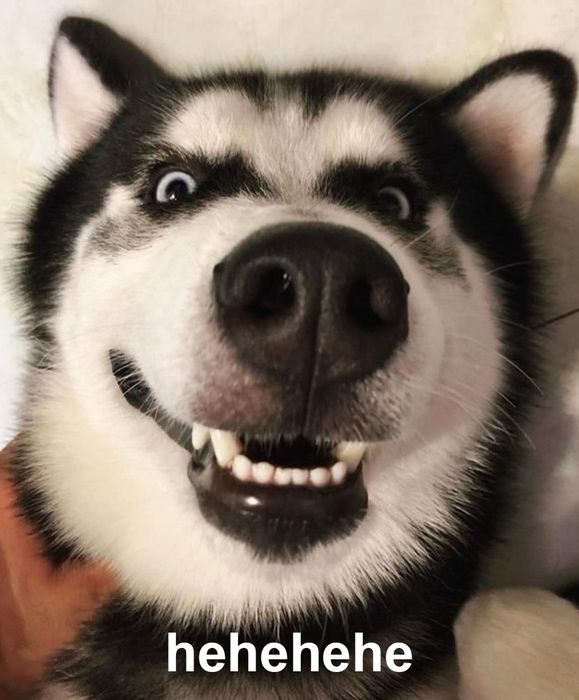

Hello! I'm thrilled to help you create a simple web game for toddlers called "Click the Sneaky Dog". Here's a basic implementation using HTML, CSS, and JavaScript. This game will display a dog that appears randomly on the screen, and the player has to click it.

**index.html**

```html
<!DOCTYPE html>
<html lang="en">
<head>
  <meta charset="UTF-8">
  <meta name="viewport" content="width=device-width, initial-scale=1.0">
  <title>Click the Sneaky Dog</title>
  <link rel="stylesheet" href="styles.css">
</head>
<body>
  <div id="gameContainer">
    
  </div>
  <script src="game.js"></script>
</body>
</html>
```

**styles.css**

```css
* {
  box-sizing: border-box;
}

body, html {
  margin: 0;
  padding: 0;
  width: 100%;
  height: 100%;
  overflow: hidden;
  display: flex;
  justify-content: center;
  align-items: center;
  background-color: #f0f8ff;
}

#gameContainer {
  position: relative;
  width: 100%;
  height: 100%;
}

#dog {
  position: absolute;
  width: 150px;
  height: 150px;
  cursor: pointer;
}
```

**game.js**

```javascript
const dog = document.getElementById('dog');
const gameContainer = document.getElementById('gameContainer');

function getRandomPosition() {
  const containerWidth = gameContainer.clientWidth;
  const containerHeight = gameContainer.clientHeight;
  const dogWidth = dog.clientWidth;
  const dogHeight = dog.clientHeight;

  const randomX = Math.floor(Math.random() * (containerWidth - dogWidth));
  const randomY = Math.floor(Math.random() * (containerHeight - dogHeight));

  return { randomX, randomY };
}

function moveDog() {
  const { randomX, randomY } = getRandomPosition();
  dog.style.left = `${randomX}px`;
  dog.style.top = `${randomY}px`;
}

function clickDog() {
  alert('Good job! You found the sneaky dog!');
  moveDog();
}

// Initial dog position
moveDog();

// Move the dog every 2 seconds
setInterval(moveDog, 2000);
```

Don't forget to create or find a suitable `dog.png` image for the game. This implementation will display a dog that changes position every 2 seconds and shows an alert message when clicked. You can adjust the timing and other aspects as needed.

To make the game full-screen, simply open the `index.html` file in a browser and it will take up the full viewport. To make it more engaging for toddlers, you can add sounds, animations, or other visual effects.